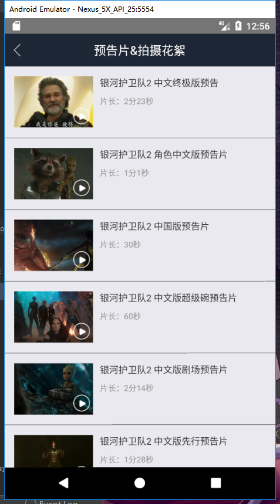
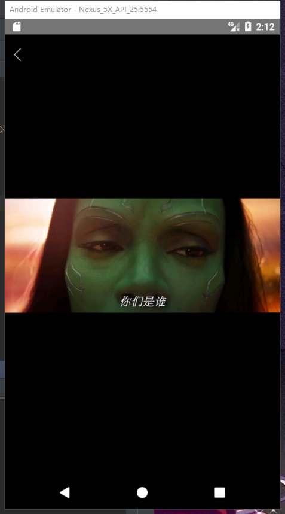
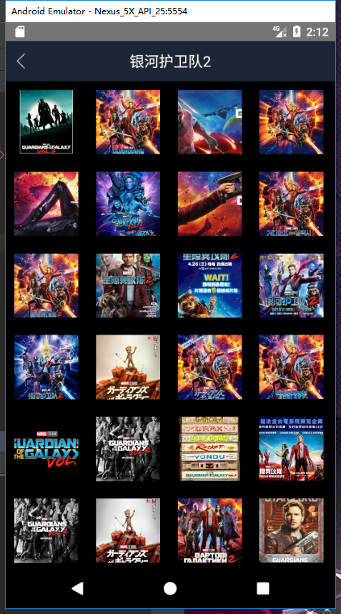
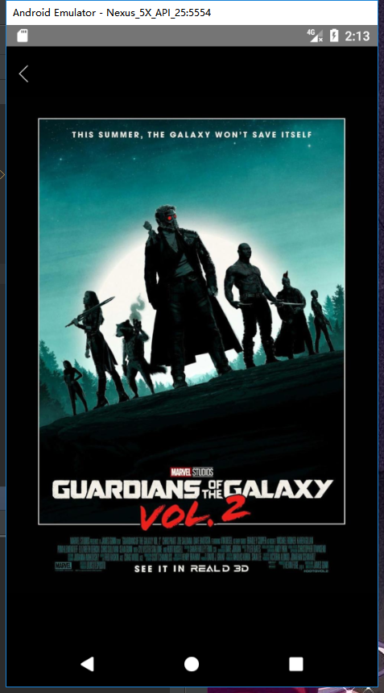

# Mtime-React-Native
 
## 具体模块与组件使用
* 用React-Native实现时光网APP（包括正在热映、影片详情、演职员表、影片评论、预告片视频播放、剧照大图查看）
 
* 使用TabNavigator作为分页导航
 
* 使用FlatList实现列表展示，实现下拉刷新&上拉加载

* 使用SectionList实现带分组头部的列表展示
 
* 使用Animated实现滑动时改变Title透明度的动画特效
 
* 使用React Native提供的Fetch API进行网络访问
 
* 引入react-native-video进行视频播放

| 集成库  | 版本  |
|:------ |:---------:|
| react | 16.0.0-alpha.6 |
| react-native | 0.44.0 |
| react-native-gallery | 0.0.17 |
| react-native-video | ^1.0.0 |
| react-navigation | ^1.0.0-beta.9 |

## 部分截图
<div>


</div>
<div>


</div>
<div>


</div>
<div>


</div>
<div>


</div>

## 证书License
```
   Copyright 2017 452MJ

   Licensed under the Apache License, Version 2.0 (the "License");
   you may not use this file except in compliance with the License.
   You may obtain a copy of the License at

     http://www.apache.org/licenses/LICENSE-2.0

   Unless required by applicable law or agreed to in writing, software
   distributed under the License is distributed on an "AS IS" BASIS,
   WITHOUT WARRANTIES OR CONDITIONS OF ANY KIND, either express or implied.
   See the License for the specific language governing permissions and
   limitations under the License.
```
